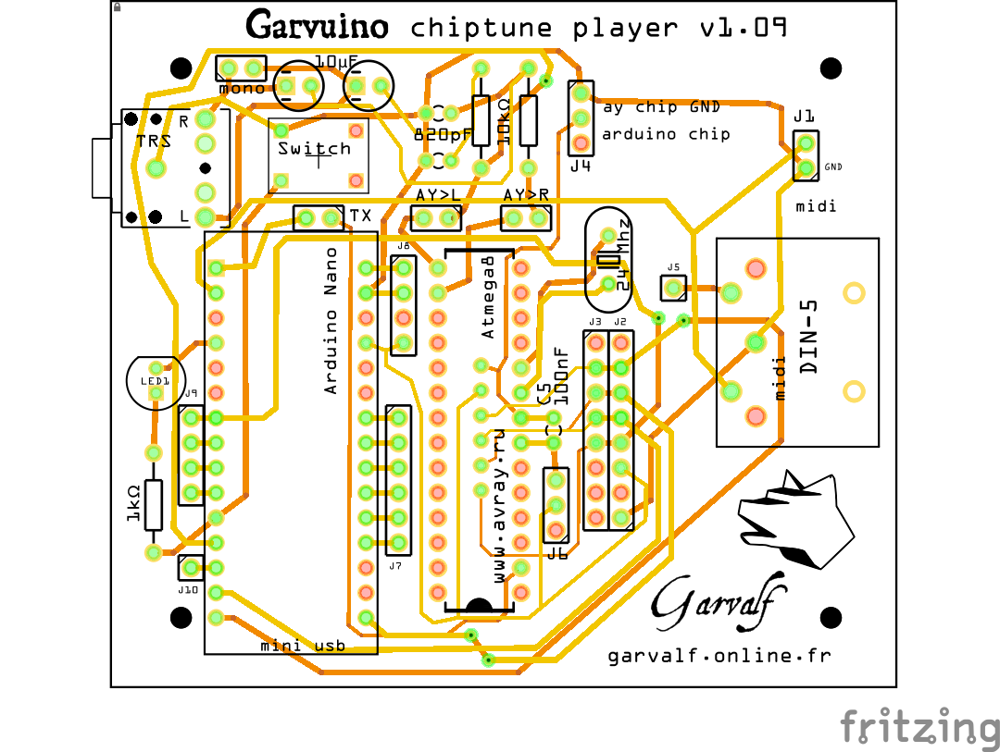
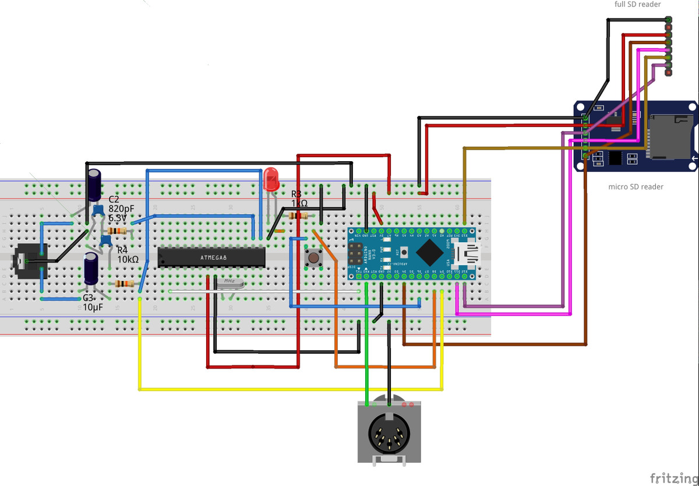

# Garvuino 

The Garvuino is a PCB board for creating musics, sounds and chiptunes.

It works with an Arduino Nano and an Atmega8 chip.

## Features 

### AY-3-8910 emulator 

On atmega8 chip, driven by the arduino nano, from the [AVR-AY project](http://avray.ru/)

 * It can replay sinclair, atari, amstrad chiptunes from the sd card
 * it might be possible to use it as a (very simple and dirty) AY synth. We just need to code the synth now.

### Sid emulator 

on arduino, from the [sid emulator lib](http://playground.arduino.cc/Main/SID-emulator)

 * it can replay some sid files, from the arduino memory, which is limited (so tunes will be cut). I'd like to find a way to stream the tune from the sd card, it's probably possible
 * it can be used as a Sid synth (see previous messages)

### 1-bit music 

From [various 1-bit engines](http://randomflux.info/1bit/viewforum.php?id=5) (on arduino)

 * it can get music from the arduino memory. 1 bit music don't need much memory so this time a whole song, even a complex one, can fit in the memory. It might be possible to stream data from SD if the 1-bit music engine chosen is the same for all the songs.
 * It should be possible to create a 1-bit synth in the future. Probably not an easy task.

### Mozzi synth 

 * [Mozzy synth](https://sensorium.github.io/Mozzi), can output fun FM sounds and many other effects.

## Bill of Materials 

    		optionnal
    		
    Garvuino PCB	1	
    crystal 24 mhz	1	
    arduino nano	1	
    atmega8	1	
    ceramic capacitor 820 pF	2	
    electrolytic capacitor 10 uF	2	
    ceramic capacitor 100 nF	1	x
    led 	1	x
    DIN5 connector (midi)	1	x
    1 kΩ Resistor	1	x
    10 kΩ Resistor	2	
    micro sd module	1	
    sd module	1	x
    momentary switch	1	
    audio jack 3.5 mm (TRS)	1	
    jumper	4	
    

## Atmega8 setup 

Get a "USBASP USB ISP Programmer & 10 Pin ISP interface Cable - AVR ATMEL ATMega".

Connect it according to this schematic:

Use a 16 Mhz crystal for example.

Once it's connected, you can program the atmega8 chip with this command-line:

    avrdude -p atmega8 -c USBasp -U flash:w:AY_Emul_244_2ch.hex -U eeprom:w:Conf_standard_24MHz_1_75Mhz.hex -U lfuse:w:0xCE:m -U hfuse:w:0xCF:m 

Please refer to [this folder](atmega8) for more info about setting up the atmega8 chip.

## Breadboard 

Please refer to [this folder](breadboard) for the fritzing sources and pdf version.

## PCB 

Please refer to [this folder](pcb) for the fritzing sources and gerber files.

## Links 

 * http://avray.ru/
 * http://playground.arduino.cc/Main/SID-emulator
 * http://randomflux.info/1bit/viewforum.php?id=5
 * https://sensorium.github.io/Mozzi

## Credits 

 * Yoruk for his help on the PCB
 * Ramiros and Evgeniy for AVR-AY emulator
 * Shiru for the 1-bit engines on Arduino
 * Christoph Haberer and Mario Patino for the Sid-arduino lib
 * The Mozzi team

## Licence 

(This licence is only for the PCB sketch, and code written from scratch. 
Code derived from other projects retains the original licence)

    BSD 3-Clause License
    Copyright (c) 2015-2017, Garvalf
    All rights reserved.
    
    Redistribution and use in source and binary forms, with or without
    modification, are permitted provided that the following conditions are met:
        * Redistributions of source code must retain the above copyright
          notice, this list of conditions and the following disclaimer.
        * Redistributions in binary form must reproduce the above copyright
          notice, this list of conditions and the following disclaimer in the
          documentation and/or other materials provided with the distribution.
        * Neither the name of the <organization> nor the
          names of its contributors may be used to endorse or promote products
          derived from this software without specific prior written permission.
    
    THIS SOFTWARE IS PROVIDED BY THE COPYRIGHT HOLDERS AND CONTRIBUTORS "AS IS" AND
    ANY EXPRESS OR IMPLIED WARRANTIES, INCLUDING, BUT NOT LIMITED TO, THE IMPLIED
    WARRANTIES OF MERCHANTABILITY AND FITNESS FOR A PARTICULAR PURPOSE ARE
    DISCLAIMED. IN NO EVENT SHALL <COPYRIGHT HOLDER> BE LIABLE FOR ANY
    DIRECT, INDIRECT, INCIDENTAL, SPECIAL, EXEMPLARY, OR CONSEQUENTIAL DAMAGES
    (INCLUDING, BUT NOT LIMITED TO, PROCUREMENT OF SUBSTITUTE GOODS OR SERVICES;
    LOSS OF USE, DATA, OR PROFITS; OR BUSINESS INTERRUPTION) HOWEVER CAUSED AND
    ON ANY THEORY OF LIABILITY, WHETHER IN CONTRACT, STRICT LIABILITY, OR TORT
    (INCLUDING NEGLIGENCE OR OTHERWISE) ARISING IN ANY WAY OUT OF THE USE OF THIS
    SOFTWARE, EVEN IF ADVISED OF THE POSSIBILITY OF SUCH DAMAGE.

