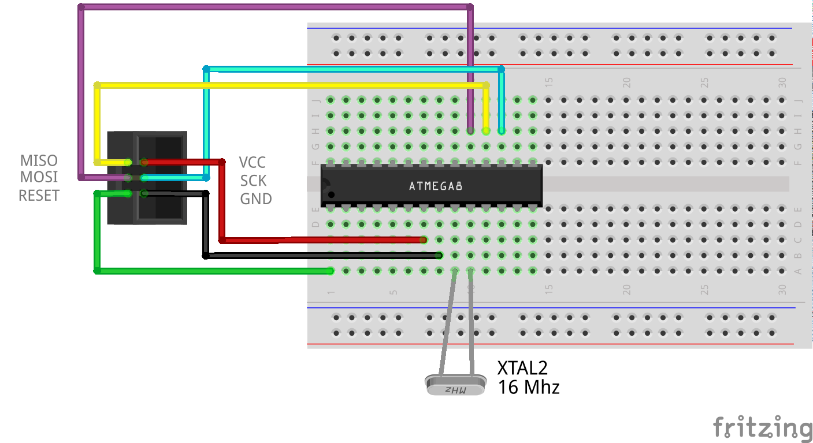

# Garvuino 

Thank you for your interest in Garvuino! The Garvuino is a PCB board for creating musics, sounds and chiptunes, either through programmation, soundtracker or live recording (midi).

It's open-source hardware, so you can modify, hack, have fun with it without restriction.

## Presentation of the board 

The board has 2 chips, the Arduino Nano chip (which in itself is a complete board for development), for computing, and an optionnal Atmega8 chip, for AY sound output.

There is a 24 Mhz crystal, for driving the Atmega8, some capacitors and resistors, for filtering the output, an optionnal SD card reader, for reading AY music files, and an optionnal DIN5 midi input, for using the board as a synth.

The Garvuino board can be used in those modes: 

### AY-3-8910 emulator 

On Atmega8 chip, driven by the Arduino nano, from the [AVR-AY project](http://avray.ru/)

 * It can replay Sinclair ZX Spectrum, Atari ST, Amstrad chiptunes from the sd card.
 * It might be possible to use it as a (very simple and dirty) AY synth. We just need to code the synth in the future.

### Sid emulator 

On Arduino, from the [sid emulator lib](http://playground.arduino.cc/Main/SID-emulator)

 * It can replay some sid files, from the arduino memory, which is limited (so tunes will be cut). We'd like to find a way to stream the tune from the sd card, it's probably possible.
 * It can be used as a Sid synth, driven by midi.

### 1-bit music 

From [various 1-bit engines](http://randomflux.info/1bit/viewforum.php?id=5) (on arduino)

 * It can play music from the arduino memory. 1-bit music don't need much memory so a whole song, even a complex one, can fit in the memory. It might be possible to stream data from SD if the 1-bit music engine chosen is the same for all the songs.
 * It might be possible to create a 1-bit synth in the future. Probably not an easy task.

### Mozzi synth 

 * [Mozzy synth](https://sensorium.github.io/Mozzi), can output fun FM sounds and many other effects.

## Assembly the board 

If you got the board through a kit, soldering it should be pretty simple as there are only basic components. 

If you have no clue about how to solder, this guide might be of some use for you: https://www.makerspaces.com/how-to-solder/

Solder the resistors and capacitors first for example, then the jumpers, socket, led, switch, crystal and audio jack. In any case, the regular sd card reader should be soldered after all of this.

If you use a micro-sd reader, it could be better to solder first the left socket for the atmega8 chip (by side of the arduino chip), then the other elements (led, resistor, pins), then the micro-sd reader, then the right part of the socket for the atmega8 chip, otherwise it's more difficult to solder the micro-sd reader, yet still possible.

There is a little error on the version 1.09 / 2017-08 of the PCB board, which I've fixed with a wire.

### Bill of Materials 

    Name                            nb    (optionnal part)
    		
    Garvuino PCB                     1	
    crystal 24 mhz                   1	
    arduino nano                     1	
    atmega8                          1	
    ceramic capacitor 820 pF         2	
    electrolytic capac. 10 uF        2	
    ceramic capacitor 100 nF         1       x
    led                              1       x
    DIN5 connector (midi)            1       x
    1 kΩ Resistor                    1       x
    10 kΩ Resistor                   2	
    micro sd module                  1	
    sd module                        1       x
    momentary switch                 1	
    audio jack 3.5 mm (TRS)          1	
    jumper                           6	
    female header socket PCB 2.54mm  1
    male pin strips 2.54             1
    female pin strips 2.54           1
    
    

### Atmega8 setup and flashing 

If you've bought the Garvuino assembled or in a kit, the atmega8 is already flashed for AY emulation. Yet, you might want to install a new revision of the AVRAY program, and use different speed and settings. Here are the instructions:

Get a "USBASP USB ISP Programmer & 10 Pin ISP interface Cable - AVR ATMEL ATMega".

Connect it according to this schematic for the atmega8:

Basically it's:

| SD reader |Atmega|
|---------------|
|MISO |pin 18: PB4|
|MOSI |pin 17: PB3|
|RESET |pin 01: PC6|
|VCC |pin 20: AVCC||
|SCK |pin 19: PB5|
|GND |pin 22: GND|

Use a 16 Mhz crystal for example, on pin 09 (PB6) and pin 10 (PB7).

Once it's connected, you can program the atmega8 chip with this command-line:

    avrdude -p atmega8 -c USBasp -U flash:w:AY_Emul_244_2ch.hex -U eeprom:w:Conf_standard_24MHz_1_75Mhz.hex -U lfuse:w:0xCE:m -U hfuse:w:0xCF:m 

## Flashing the Garvuino board 

This board is supposed to work extensively with the Arduino IDE (http://arduino.cc/). You must download it and use it for developping, changing sounds and engines. The only exception is if you only intend to use the board as a AY player, then you can just change the tunes on the SD card.

Programs on Arduino are called sketches. Most sketches are tested with Arduino IDE 1.8.# but they should work with IDE 1.6.#

For flashing, just launch the Arduino IDE, connect the arduino to your computer using an USB mini cable, select in the tools>arduino nano, atmega328, select the right port. 

Load a sketch from the arduino_sketches/ folder.

For flashing, you need to unplug the midi cable from your synth ir garvuino if it's connected, or powerdown the synth. If you want to develop a sketch on garvuino, it can be tiresome to always unplug the midi. You can use a simpler wire <=> midi connected to the J1, with GND to midi GND (pin 2) and the other slot (which is connected to the RXD port) to the midi pin 5, this way it's faster to unplug.

### Flashing for AY music 

Just load avray/avray_sd_sketch/avray_sd_sketch.ino, put some tunes from tunes/aym_tunes/1_75MHz/rsf/ into your SD card and power the device!

### Sid emulator 

load /sid/sid_midi/sid_midi.ino for the Sid emulator synth. Change sound mode with the switch. You can change some sound with knobs on your keyboard. The sketch is programmed for my Behringer UMA25S keyboard, knob E09 to E13 (midi control 71 to 75).

There is also a sid player (/sid/sid_player/) which can load some SID data and play it from the arduino (at the moment it can only load from memory, which isn't big enough for a complete song).

### Flashing for 1-bit music 

Only one 1-bit music can be installed into the Arduino at a time. Load a sketch, for example beeper/arduino_qchan/arduino_qchan.ino and flash the Arduino. Music should go out of the mini-jack now!

You can compose music using the [beepola tracker](http://freestuff.grok.co.uk/beepola/).

Beepola can use the Tritone, Qchan and Phaser1 engines. 

There are python converters in the folder to convert your own music to arduino code. Just make it into beepola and export it to .bin format. Then include your code into the arduino sketch (use #include "music_data_yoursong.h" instead of #include "music_data_garvalf.h" or #include "music_data_vapeurs.h" or #include "music_data_bourrasque.h" for example)

For the octode engine, you'll have to edit a .xm file with a tracker like milkytracker. See http://battleofthebits.org/lyceum/View/Octode for more informations. There is a xm to arduino converter in the arduino_octode folder as well.

Read more on the [1-bit forum thread](http://randomflux.info/1bit/viewforum.php?id=5) (search for arduino)

If you have some problem for creating your own music and exporting it to arduino, you can join the 1-bit forum to request for help.

### Flashing for Mozzi synth 

*TO BE CONTINUED*

